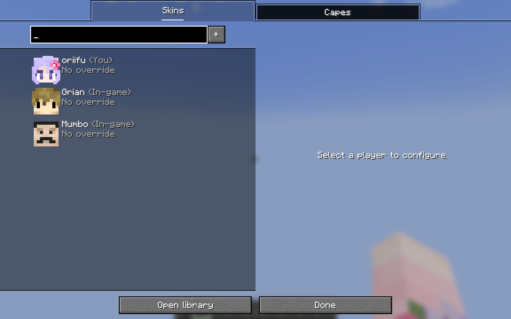
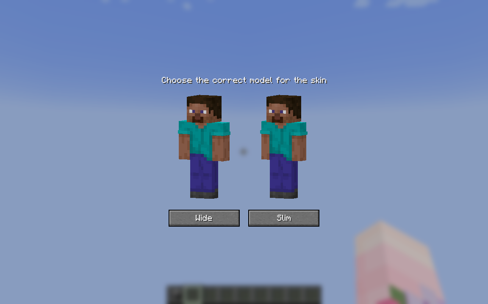
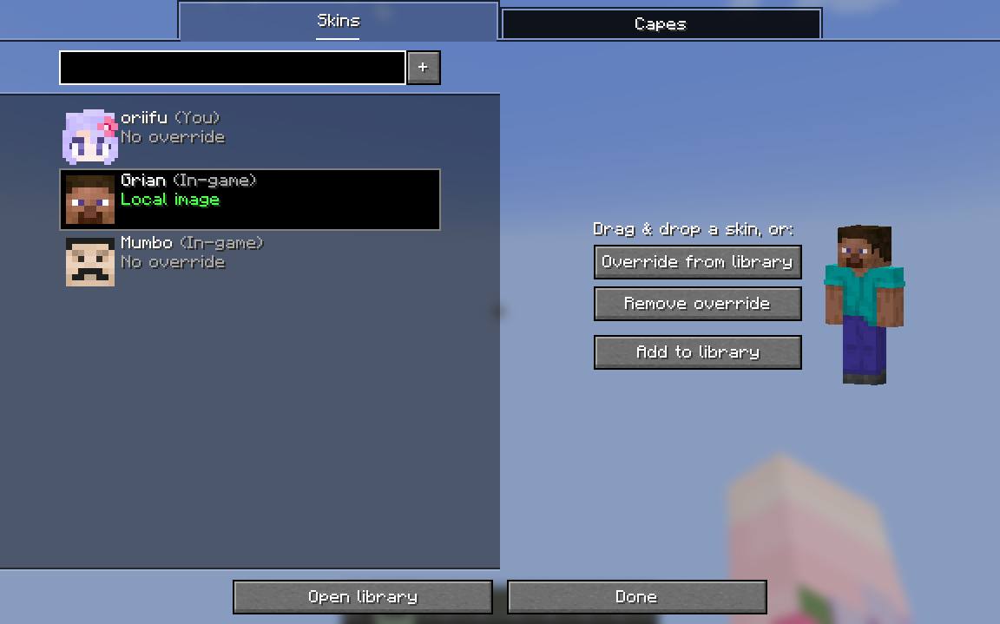
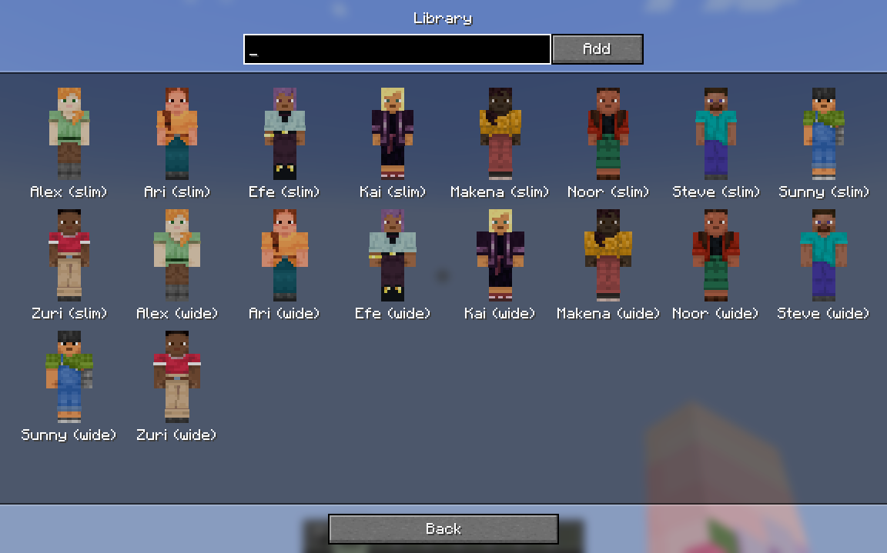
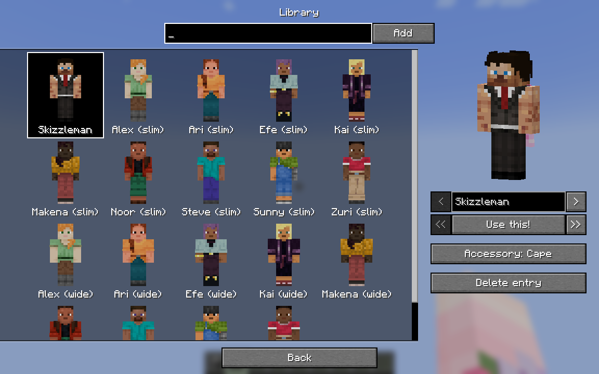

skin overrides is a mod for minecraft that lets you change the way skins and capes show up. this page has a general overview--for more info, check out [advanced usage](/skin-overrides/advanced/) and [tips & tricks](/skin-overrides/tips-and-tricks/)!

## overrides

overrides are a way to change how skins or capes show up. overrides can apply to yourself, or to any other player.

### adding an override

you can open the overrides screen by pressing the config button from mod menu or by pressing the skin overrides key (defaults to O). this screen will list yourself, all your overrides, and also any online players.

you can select a player on the left to add an override. from here, you can drag and drop in a skin texture, or:

- override from library -- pick an override from your library
- remove override -- remove any existing override
- add to library -- adds this skin to your library
- change skin globally (only for yourself) -- change your profile's skin

here, i dragged in a steve skin. it'll now prompt me to ask whether this is a wide or slim skin. you can drag the players to spin them, if it helps.

once we pick whether it's slim or wide, our override has been created! the status under the player name on the left has changed to "local image".

### changing my skin

if you have an override on your own profile, you can press the "change skin globally" button. when you press it, a confirmation screen will pop up, with information about what will happen and if other players will see the change instantly.

when on a server with skin overrides installed, your skin will update for other players online--see [the page on networking](/skin-overrides/networking/) for more information!

## the library

the library allows you to keep all your skins or capes neatly organised to access them easily. this also enables you to use shared overrides, meaning other players will be able to see your override!

note that only your override for yourself is shared, not for any other players you have overridden.

### visiting the library

by pressing the "open library" button in the bottom left or the "override from library" button in the options list, you can enter your personal library. by default, your skin library will include all the default skins.

you can use the search bar at the top to filter the things in your library. you can also use it to get a player's skin, by entering their name and pressing add! here i've entered "skizzleman" and pressed enter to get this:

once you've picked an entry like above, you will have a bunch of options:

- name input, for changing your entry's name
- the "use this" button, which uses this override for the selected player
- the left and right arrow buttons, for switching to the previous or next entry
- the double left and right arrow buttons, for moving your entry backwards and forwards
- the "accessory" toggle, which can change whether the profile is previewed with your cape.
  this can be "cape", "elytra", or "off".
- the delete entry button, which deletes this entry

### sharing my override

once you have a library override, your skin is shared with other players online! this will only work if the server has skin overrides installed. for more information about this, check out [the networking page](/skin-overrides/networking/).

<!-- location: /execute in minecraft:overworld run tp @s 25.98 -54.88 9.70 268.95 4.80 -->
